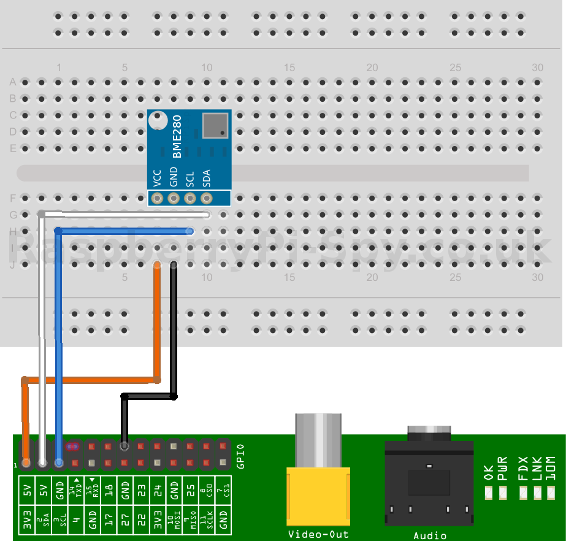
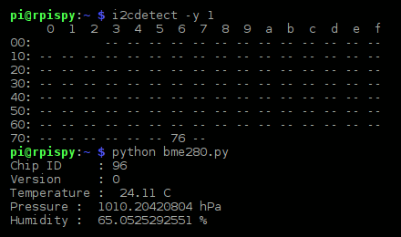

# bme280-rpi4

## Hardware setup
Here is a diagram of a breadboard setup.



Before running the script you should check that your device is connected

```bash
sudo i2cdetect -y 1
```

## Running the script

```bash
python bme280.py
```

**Terminal output**



**Reference**
https://www.raspberrypi-spy.co.uk/2016/07/using-bme280-i2c-temperature-pressure-sensor-in-python/
